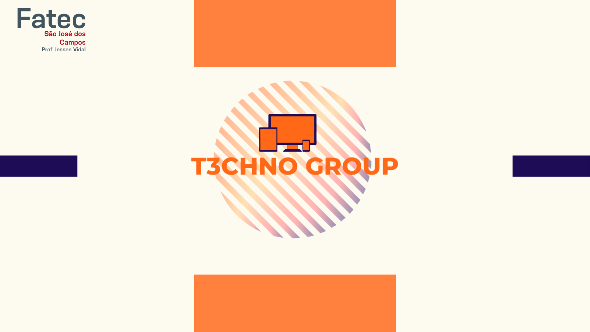
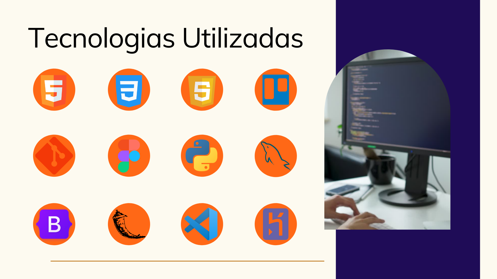

# Projeto-InFatec


## Dev Team

* Lucas Braz Dias (Product Owner)
#### [Linked](https://www.linkedin.com/in/lucas-braz-dias/) [Github](https://github.com/lucasbdias)


* Priscila Aparecida Silva (Scrum Master)
#### [Linked](https://www.linkedin.com/in/priscilasilva1801/) [Github](https://github.com/prsilva)


* Tais Gomes Salomao (Dev Team)
#### [Linked](https://www.linkedin.com/in/tais-salomao) [Github](https://github.com/taissalomao)


* Elen Fernanda dos Santos Petri (Dev Team)
#### [Linked](https://www.linkedin.com/in/elen-petri/) [Github](https://github.com/elenpetri)


* Rodrigo de Andrade Paula (Dev Team)
#### [Linked](https://www.linkedin.com/in/rodrigo-de-andrade-a34605104) [Github](https://github.com/RodrigodeAndrade90)


* Felipe Gabriel Barreto Faria (Dev team)
#### [Linked](    ) [Github](https://github.com/OFelipeGabriel)


* Felipe Matias de Lima Santos (Dev team)
#### [Linked](https://www.linkedin.com/in/felipe-matias-55a67021b/) [Github](https://github.com/FelipeMTS)


* Kevin Ferreira Mirenda (Dev team)
#### [Linked](    ) [Github](https://github.com/   )


## API 1º Semestre do Curso de Desenvolvimento de Software Multiplataforma

* M2: Prof. Gerson da Penha Neto
* P2: Prof. Fabricio Galende M Carvalho


## Objetivo do Projeto
A carga de dados georreferenciados é uma atividade contínua durante os projetos que utilizam diversos software GIS para organizar e fazer o processamento de imagens de satélite. O resultado desse processamento, a depender do projeto, é o que se utiliza para desenvolvimento de produtos. A solução escolhida foi a ferramenta de ETL espacial GEOFIP, cuja estrutura conceitual é apresentada na figura abaixo.


## Ferramenta Desenvolvida
Essa ferramenta será configurada para entender os arquivos de formato shapefile e realizar conversões, usando regras definidas na etapa de planejamento, buscando compatibilidade com normas oficiais, e carregá-los e manipulá-los no banco de dados geográficos PostgreSQL com extensão Postgis, de acordo com a modelagem física definida pelo cliente. Também realiza o processo inverso de gerar um arquivo shapefile a partir de uma tabela do banco de dados PostgreSQL.


## *User story*


| Quem | O que? | Para |
|:--------------:  | :----------:|:---------------------------------------------------------|
|    Analista de Dados Espaciais   | Gostaria da Prototipação da Ferramenta desenvolvida. | Para ter uma visão global do desenvolvimento do produto, verificar o entendimento das funcionalidades da ferramenta e fazer possíveis apontamentos de melhorias na usabilidade.|
|    Analista de Dados Espaciais   |Gostaria da interface gráfica fazendo a extração dos dados Shapefile e a conexão com o banco de dados|Para iniciar o processo de utilização da função “de para” da ferramenta.|
|    Analista de Dados Espaciais   |Gostaria que a ferramenta execute e transforme os dados e faça a parametrização com o Banco de Dados| Para atender as necessidades do negócio.|
|    Analista de Dados Espaciais   |Gostaria de um ambiente de desenvolvimento de tarefas e transformações geográficas e que o sistema realize o processo inverso de conversão de dados| Para atender as necessidades do negócio. E trazer soluções rápida de desenvolvimento de produtos para sistemas.|
|    Analista de Dados Espaciais   |Gostaria de uma ferramenta que me forneça condições de aplicar regras de transformação nos dados  | Para desenvolver novos produtos de acordo com a solicitação dos setores.| 
|    Analista de Dados Espaciais   |Gostaria de uma ferramenta intuitiva, de fácil usabilidade,  com manuais de instruções| Para melhorar a experiência do usuário com a ferramenta|





## Passo a passo da instalação do sistema

```bash
git clone https://github.com/T3chnogroup/Projeto-InFatec.git
cd Projeto-InFatec
```

Criar ambiente virtual Python:
```bash
python3 -m venv env
```
Iniciar ambiente:

Para Windows:
```bash
.\env\Scripts\activate
```

Para Linux:
```bash
source env/bin/activate
```

Instalar dependencias:
```bash
pip3 install -r requirements.txt
```

Executar aplicação:
```bash
python3 wsgi.py
```
## Sistema Desenvolvido 


